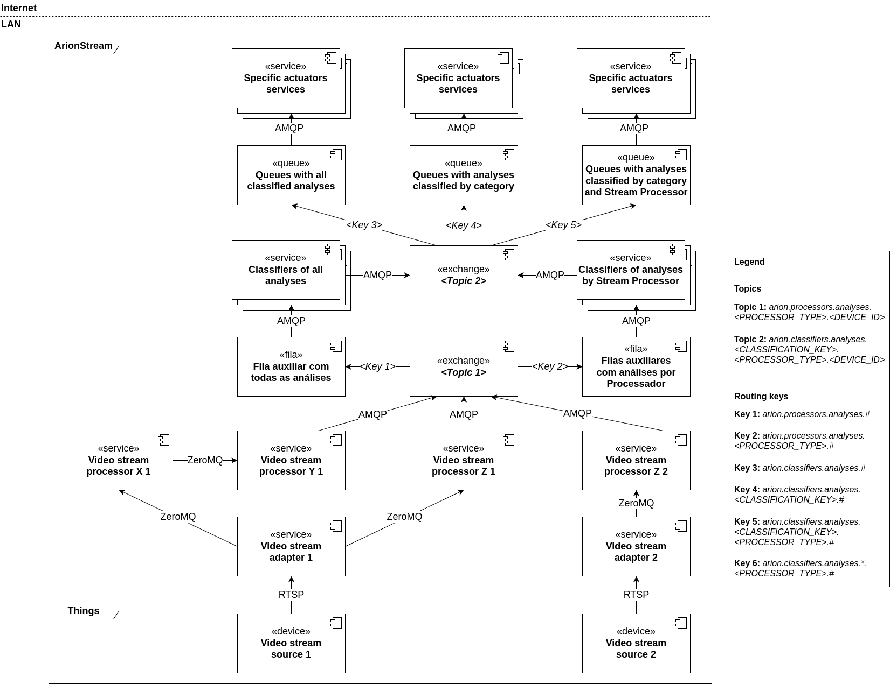

# ArionStream: a distributed architecture for real-time video analysis in edge IoMT applications

## Introduction

The ArionStream project introduces an innovative distributed architecture designed for real-time video analysis in edge Internet of Multimedia Things (IoMT) applications. Utilizing a microservices-based approach, ArionStream enables efficient and scalable video data processing by decentralizing the processing to reduce latency and improve efficiency.

This modular and distributed architecture provides a robust foundation for developing projects that require edge image processing, making it ideal for critical applications where speed and accuracy are essential.

## Architecture

The system is designed using a microservices architecture, where each component has a distinct responsibility. The Stream Adapter connects to the stream source and can broadcast the image stream to multiple Stream Processors. These processors handle the image stream, extracting data for analysis. The Broker facilitates communication between the Stream Processors, Classifiers, and Actuators. The Classifier interprets the data from the Stream Processors, enhancing its significance. Finally, the Actuator takes actions based on the classified data.

### Components

- Stream Adapter: This component is responsible for connecting to the stream source and providing the image stream to the Stream Processors.
- Stream Processor: This component is responsible for processing the image stream and providing data to be analyzed.
- Broker: This component is responsible for connecting the Stream Processors, Classifiers and Actuators.
- Classifier: This component is responsible for classifying the data provided by the Stream Processors, making the to be more meaningful.
- Actuator: This component is responsible for taking actions based on the data provided by the Classifiers.

The next figure illustrates the system's architecture.



## Main Technologies

- Stream Adapter: Python, OpenCV, VidGear, ImageZMQ, ZeroMQ Protocol
- Stream Processor: Python, OpenCV, VidGear, ImageZMQ, ZeroMQ Protocol, AMPQ Protocol
- Broker: RabbitMQ
- Classifier: Node.js, TypeScript, AMPQ Protocol
- Actuator: Node.js, TypeScript, AMPQ Protocol

For orchestrating the components, Docker and Docker Compose are used.

## How to run

To run the system, you need to have Docker and Docker Compose installed on your machine. After that, you need to create a `.env` file in the root directory of the project. You can copy the `.env.example` file and rename it to `.env`:

```bash
cp .env.example .env
```

Then, you can run the following command to start the system:

```bash
docker compose --profile all up --build
```
